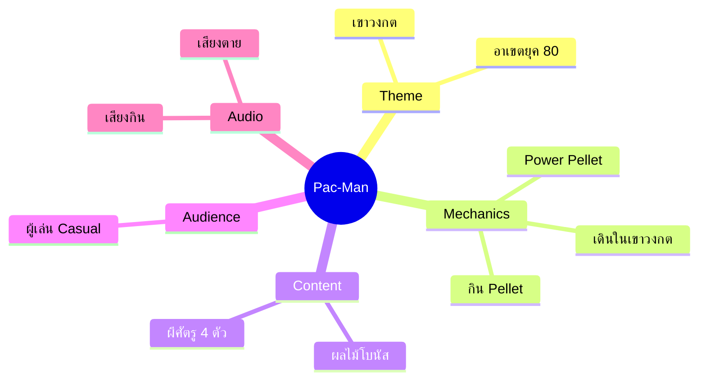
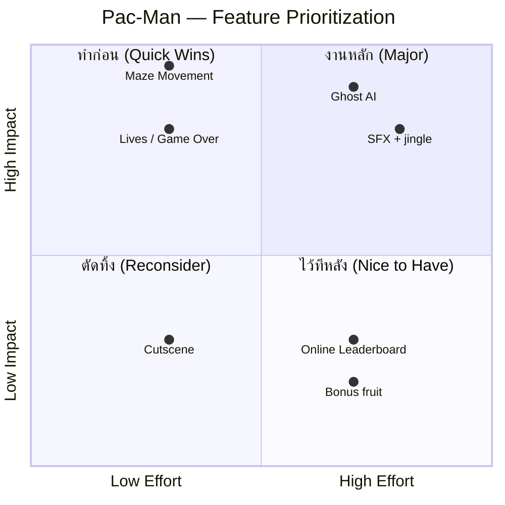
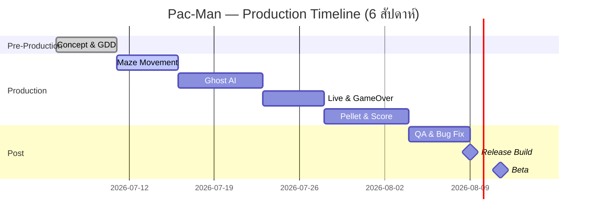

```mermaid
mindmap
  root((Pac-Man))
    Theme
      เขาวงกต
      อาเขตยุค 80
    Mechanics
      เดินในเขาวงกต
      กิน Pellet
      Power Pellet
    Content
      ผีศัตรู 4 ตัว
      ผลไม้โบนัส
    Audience
      ผู้เล่น Casual
    Audio
      เสียงกิน
      เสียงตาย
```

```mermaid
quadrantChart
    title Pac-Man — Feature Prioritization
    x-axis "Low Effort" --> "High Effort"
    y-axis "Low Impact" --> "High Impact"
    quadrant-1 "งานหลัก (Major)"
    quadrant-2 "ทำก่อน (Quick Wins)"
    quadrant-3 "ตัดทิ้ง (Reconsider)"
    quadrant-4 "ไว้ทีหลัง (Nice to Have)"
    "Maze Movement": [0.3, 0.95]
    "Ghost AI": [0.7, 0.9]
    "Online Leaderboard": [0.7, 0.3]
    "Bonus fruit": [0.7, 0.2]
    "Lives / Game Over": [0.3, 0.8]
    "SFX + jingle": [0.8, 0.8]
    "Cutscene": [0.3, 0.3]
```

Live / GameOver และ SFX + jingle เป็น MVP ควรทำก่อนเป็นงานหลัก

Bonus fruit เก็บไว้ทำทีหลัง

Cutscene สามารถตัดทิ้งได้เลย

```mermaid
gantt
title Pac-Man — Production Timeline (6 สัปดาห์)
dateFormat YYYY-MM-DD
section Pre-Production
Concept & GDD :done, c1, 2026-07-06, 5d
section Production
Maze Movement :active, p1, after c1, 5d
Ghost AI : p2, after p1, 7d
Live & GameOver : p3, after p2, 5d
Pellet & Score : p4, after p3, 7d
section Post
QA & Bug Fix : q1, after p4, 5d
Release Build :milestone, m1, after q1, 0d
Beta :milestone, m2, after m1, 5d
```
